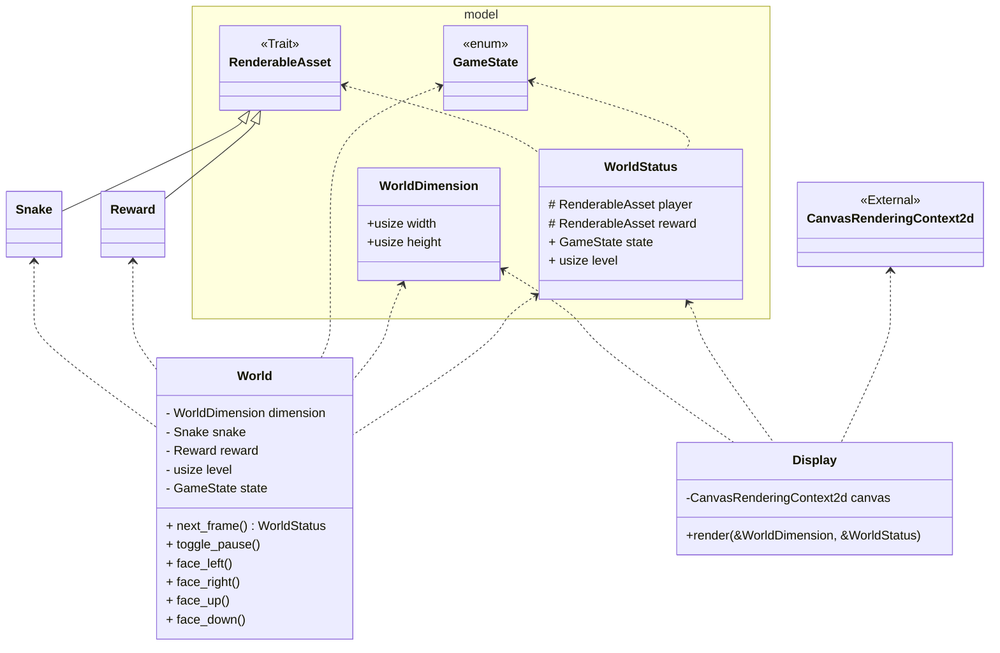

Rust WASM Demo: Snake Game
===============================

Goal
------

The goal of this example is to show ...

- what is necessary to build a WASM module from rust code
- how to call a WASM module from javascript/typescript
- how the rust code can operate within the browser context

Tech Stack
------------

On top level there are two parts to it:

- WASM module, written in [Rust](https://www.rust-lang.org), containing all logic
- [TypeScript](https://www.typescriptlang.org)-based "application shell" initializing the WASM module and connecting it

Additionally following tools are used:

- [wasm-pack](https://github.com/rustwasm/wasm-pack) to compile the Rust code into a package, usable in the application
  shell
- [npm](https://www.npmjs.com) to manage dependencies inside the application shell
- [webpack](https://webpack.js.org) to compile start the dev server

Structure
----------------

### Application shell

The application shell contains the basic HTML structure with the `canvas` element that will be used to draw the UI on.
Additionally the `index.ts` file bootstraps the WASM module and connects two main parts from the WASM module to the
browser UI:

#### render loop

The main render loop calls the WASM module objects into action and queues up the next render cycle for processing.

```typescript
function update() {
    setTimeout(() => {
        // calls to WASM module objects
    }, A_SECOND / frames_per_second)
}
```

The loop makes two calls to the WASM objects to calculate the next step and to subsequently draw that calculated state
on the canvas

```typescript
const newStatus = world.next_frame();
// ... [fps calculation]
paint(newStatus);
```

#### input handling

A `keydown` event listener is registered on the window to translate the pressed keyboard keys into method calls on the
WASM module objects.

```typescript
window.addEventListener("keydown", evt => {
    switch (evt.code) {
        // ...
    }
})
```

### WASM logic module

The WASM module contains two main parts, which are mostly disconnected:

- `World` containing all the logic and state handling
- `Display` to draw a given state onto a canvas

This split is down to showcase, that rust WASM modules can be used either only for backend logic (-> `World`), but they
can also interact with the HTML elements (-> `Display`)



Getting Started
-----------------

First, install all the necessary tools, as listed in "tech stack".
Also make sure to have the `wasm32-unknown-unknown` target installed via `rustup`:

```sh
rustup target add wasm32-unknown-unknown
```

And install all necessary node modules via `npm`:

```sh
# inside www directory
npm ci
```

### Build WASM module

```sh
# on repo root level
wasm-pack build --target web
```

### Run (webpack) Dev Server

```sh
# inside www directory
npx tsc # to build the index.js from the index.ts
npm run dev
```
